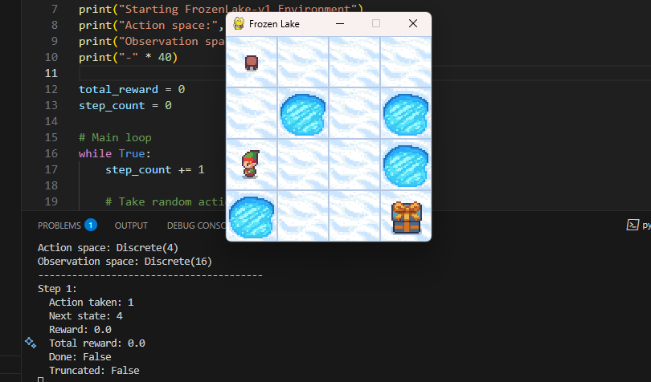

# Atari Gymnasium In class Activity - Group 3
This code demonstrates random action selection in OpenAI Gymnasium environments as part of a classroom activity.



## Environment
- **Environment Used**: FrozenLake-v1
- **Objective**: Navigate from start to goal without falling in holes
- **Actions**: 0=Left, 1=Down, 2=Right, 3=Up

## Requirements
```bash
pip install gymnasium
```

## How to Run
```bash
python atari-file.py
```

## What the Code Does
1. Loads the FrozenLake-v1 environment
2. Takes random actions in a loop
3. Prints after each action:
   - Action taken
   - Next state
   - Reward received
   - Total reward
   - Termination status
4. Terminates when goal reached or max steps exceeded

## Sample Output
```
(base) PS C:\Users\HP\Atari_group3> python atari-file.py      
Starting FrozenLake-v1 Environment
Action space: Discrete(4)
Observation space: Discrete(16)
----------------------------------------
Step 1:
  Action taken: 2
  Next state: 0
  Reward: 0.0
  Total reward: 0.0
  Done: False
  Truncated: False
Step 2:
  Action taken: 1
  Next state: 0
  Reward: 0.0
  Total reward: 0.0
  Done: False
  Truncated: False
Step 3:
  Action taken: 3
  Next state: 0
  Reward: 0.0
  Total reward: 0.0
  Done: False
  Truncated: False
Step 4:
  Action taken: 2
  Next state: 1
  Reward: 0.0
  Total reward: 0.0
  Done: False
  Truncated: False
Step 5:
  Action taken: 3
  Next state: 1
  Reward: 0.0
  Total reward: 0.0
  Done: False
  Truncated: False
Step 6:
  Action taken: 0
  Next state: 0
  Reward: 0.0
  Total reward: 0.0
  Done: False
  Truncated: False
Step 7:
  Action taken: 2
  Next state: 4
  Reward: 0.0
  Total reward: 0.0
  Done: False
  Truncated: False
Step 8:
  Action taken: 2
  Next state: 8
  Reward: 0.0
  Total reward: 0.0
  Done: False
  Truncated: False
Step 9:
  Action taken: 3
  Next state: 9
  Reward: 0.0
  Total reward: 0.0
  Done: False
  Truncated: False
Step 10:
  Action taken: 2
  Next state: 10
  Reward: 0.0
  Total reward: 0.0
  Done: False
  Truncated: False
Step 11:
  Action taken: 2
  Next state: 11
  Reward: 0.0
  Total reward: 0.0
  Done: True
  Truncated: False

Episode finished after 11 steps
Final reward: 0.0
Goal reached or fell in hole!
Environment closed
```

The script displays step-by-step information showing:
- Random actions being selected
- State transitions after each action  
- Rewards accumulated
- Episode termination conditions

## Authors
- Eunice Adewusi
- Audry Chivanga
- Humphrey Nyahoja
- Liliane Kayitesi
- Jean Chrisostome
- Ronald Abimbola